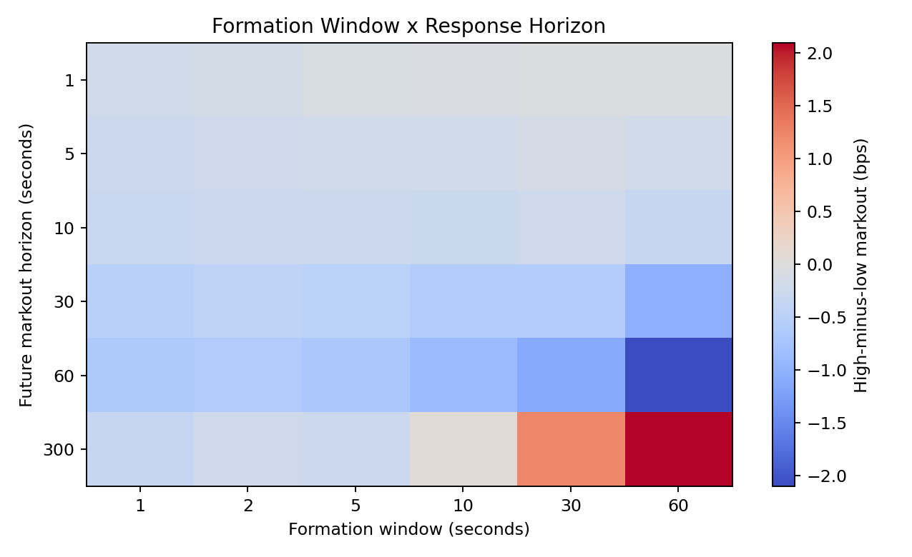

# When Is a Fill Bad?
## Synthetic Exact Fills and Real BTC Execution-Pressure Validation

**Can market states associated with easier passive execution also produce worse execution quality?**

In the real BTC sample, execution-pressure proxies produce adverse post-quote ordering at short and intermediate horizons. A richer proxy combining market pressure, cancellation, and replenishment does not robustly outperform market-order pressure alone. The effect is horizon-dependent, day-dependent, and not clearly separated from a local shuffled null.

The real-data layer uses execution pressure as a proxy because exact FIFO fills are not observed in the one-second aggregated dataset.



*Execution pressure orders future passive-side markout at short and intermediate horizons, while the relation weakens and reverses at longer horizons.*

## Evidence Design

```text
Synthetic controlled experiment
-> exact hypothetical fills
-> fill likelihood
-> post-fill markout

Real BTC validation
-> execution-pressure proxy
-> future side-adjusted markout
```

## Data

| Item | Value |
|---|---:|
| Real dataset | Coinbase BTC |
| Rows | 1,030,728 |
| Frequency | ~1 second |
| Book depth | 15 levels |
| Date range | 2021-04-07 to 2021-04-19 UTC |
| Available activity | market / limit / cancel notional |
| Exact FIFO fills | unavailable |

## Research Components

- Million-row real LOB data pipeline with schema audit and Parquet conversion.
- Synthetic exact-fill experiment for controlled passive-order replay.
- Side-adjusted passive-buy and passive-sell markout construction.
- Execution-pressure proxy family based on market flow, cancellation, replenishment, and displayed depth.
- Chronological train/validation/test evaluation.
- Multi-scale response analysis across formation windows and markout horizons.
- Day-level stability analysis and local shuffled-null test.
- Reproducible Makefile pipeline with focused tests.

## Evidence Summary

| Question | Result |
|---|---|
| Does execution pressure order future markout? | Partly, at short/intermediate horizons |
| Does full proxy beat market-only? | No |
| Do cancellation and replenishment add stable value? | No |
| Is the effect stable by day? | No, one day materially influences the buy side |
| Does the local null confirm sequence structure? | No |
| Is the pipeline reproducible? | Yes |

Supported:

- complete and reproducible real BTC proxy pipeline;
- short/intermediate adverse ordering in selected scales;
- market-order pressure provides the clearest simple ordering.

Partially supported:

- full execution pressure carries information in selected regimes;
- the effect is stronger on specific days and horizons.

Unsupported:

- cancellation and replenishment add stable incremental value;
- the full proxy robustly beats market-only;
- the local sequence mechanism is confirmed by the shuffled null;
- the effect is stable across all days and horizons.

## Interpretation

The project shows how a plausible richer execution-pressure signal can fail to improve on a simpler baseline once chronological validation, horizon analysis, daily stability, and null tests are applied. That negative-result discipline is central to the research value: the pipeline preserves the mechanism hypothesis while making the evidence boundary explicit.

## Reproduction

```bash
make real-btc-validation
python -m pytest tests
```

Synthetic validation remains available:

```bash
make reproduce
```

## Limitations

- Exact real fills are unavailable.
- One-second aggregation removes intrasecond event order.
- The sample covers one venue and one short period.
- `2021-04-18` materially influences the buy-side aggregate.
- Null results limit sequence-mechanism claims.
- No live trading or profitability claim.

## How To Review This Project

30 seconds: README summary and hero figure.

3 minutes: [PORTFOLIO_BRIEF.md](PORTFOLIO_BRIEF.md).

15 minutes: [RESEARCH_NOTE.md](RESEARCH_NOTE.md).

Code: `src/fillbad/`.

Full methodology and results: [RESEARCH_NOTE.md](RESEARCH_NOTE.md)
