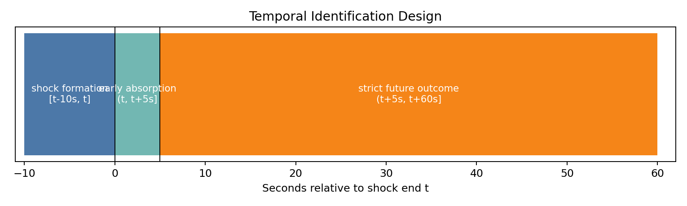

# When Is a Fill Bad?
## Passive Quotes, Book Absorption, and Short-Horizon Markout

**Can passive-side states associated with easier execution also produce worse post-fill or post-quote price outcomes?**

The project started from a simple concern in passive execution: a quote may be easy to fill because the book is failing to absorb pressure. That is not automatically a good fill.

There are two parts:

- a synthetic order-book experiment, where passive fills and post-fill markouts are observed exactly;
- a Coinbase BTC one-second book dataset, where exact FIFO fills are not available, so the real-data test uses quote-pressure shocks and later quote/price response.

The main real-data test uses non-overlapping windows:

```text
[t-10s, t]      pressure shock
(t, t+5s]       early book absorption
(t+5s, t+H]     later quote survival and markout
```

The stricter timing test cuts down the earlier effect. The first five seconds of book response still separate later quote survival and markout at 10s and 30s. By 60s the effect is weaker, and the 200-seed stratified null is not decisive. I treat this as a short-horizon microstructure result, not as a trading signal.



## Data

| Item | Value |
|---|---:|
| Real dataset | Coinbase BTC |
| Rows | 1,030,728 |
| Frequency | ~1 second |
| Visible depth | 15 levels |
| Date range | 2021-04-07 to 2021-04-19 UTC |
| Valid strict shock episodes | 22,300 |
| Train / validation / test episodes | 10,700 / 6,732 / 4,868 |
| Exact FIFO fills | unavailable |
| Live trading claim | none |

## Main Result

Absorption is measured only in the first 5 seconds after the shock. Future markout is then measured from the midpoint at `t+5s`, not from the pre-shock midpoint.

| Side | Total time after shock | Strong - weak future markout | Block-bootstrap CI | Strong - weak quote survival |
|---|---:|---:|---:|---:|
| buy | 10s | +0.8446 bps | [+0.3975, +1.3342] | +7.63 pp |
| buy | 30s | +1.5725 bps | [+0.3329, +3.2433] | +3.89 pp |
| buy | 60s | +1.7922 bps | [-0.1318, +3.8304] | +2.83 pp |
| sell | 10s | +0.6761 bps | [+0.2724, +1.1462] | +6.47 pp |
| sell | 30s | +1.6727 bps | [+0.5720, +3.3205] | +4.79 pp |
| sell | 60s | +0.4369 bps | [-1.3973, +2.3350] | +0.62 pp |

Positive strong-minus-weak markout means stronger early absorption is followed by better passive-side outcomes. The short-horizon result is supported on both sides; the 60-second result is weaker.

## Stratified Null

The expanded stratified null uses 200 seeds and preserves date, side, shock-intensity bin, pre-shock depth bin, spread regime, volatility regime, and time-of-day block.

At 60 seconds:

| Side | Real strong - weak markout | Null mean | Empirical two-sided p-value |
|---|---:|---:|---:|
| buy | +1.7922 bps | +0.3813 bps | 0.1045 |
| sell | +0.4369 bps | +0.1226 bps | 0.6517 |
| combined | +1.0881 bps | +0.1748 bps | 0.1542 |

The null is directionally supportive for the buy side but not decisive. The conclusion is narrow: early absorption contains short-horizon state information; the longer-horizon and null-adjusted evidence is mixed.

## Code And Outputs

- Synthetic exact-fill experiment for controlled passive-order replay.
- Real BTC data pipeline with schema audit, Parquet conversion, and canonical LOB features.
- Side-adjusted passive-buy and passive-sell markout conventions.
- Static pressure baselines retained as a falsified simple proxy.
- Dynamic shock analysis using 15-level visible depth, potential penetration, early absorption, and later outcomes.
- Temporal leakage audit, block-bootstrap uncertainty, expanded stratified null, and concentration diagnostics.

## Reproduction

```bash
make dynamic-lob
python -m pytest tests
```

Earlier validation layers remain available:

```bash
make real-btc-validation
make reproduce
```

## Limitations

- Exact real passive fills and FIFO queue position are unavailable.
- One-second aggregation removes intrasecond event order.
- Potential penetration is measured against visible displayed depth, not hidden liquidity.
- The sample covers one venue and a short date range.
- The strict result is strongest at 10s and 30s; longer-horizon evidence is mixed.
- No live trading, market-making, optimal-execution, or profitability claim is made.

## Where To Look

- Short version: [PORTFOLIO_BRIEF.md](PORTFOLIO_BRIEF.md)
- Technical note: [RESEARCH_NOTE.md](RESEARCH_NOTE.md)
- Main pipeline: `scripts/run_dynamic_lob_analysis.py`
- Core tests: `tests/test_dynamic_lob.py`
