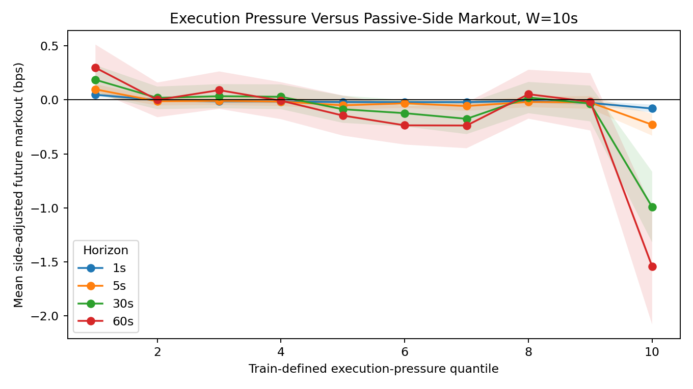

# When Is a Fill Bad?

**Can easier passive execution coincide with worse execution quality?**

This repository studies that question with two complementary layers: a controlled synthetic exact-fill experiment and a real Coinbase BTC execution-pressure validation using 1,030,728 one-second LOB observations.

The main real-data result is restrained: higher passive-side execution pressure is associated with more adverse future markout in selected regimes, especially passive-buy states on 2021-04-18, but the effect is not uniformly stable across all days, sides, and horizons.

**Boundary:** the real BTC data do not contain exact order-level passive fills or FIFO queue position. Execution pressure is used as a proxy for quote-consumption conditions.



## Evidence Design

| Layer | What it measures | Evidence boundary |
|---|---|---|
| Synthetic controlled experiment | exact hypothetical fills, fill likelihood, post-fill signed markout | simulated queue and event assumptions |
| Real Coinbase BTC validation | passive-side execution pressure, post-quote side-adjusted markout | one-second aggregates, no exact fills |

## What Was Built

- Event-driven synthetic LOB replay with passive buy/sell orders.
- Fill, censoring, and signed post-fill markout labels.
- Real BTC schema audit and Parquet conversion.
- Side-specific passive quote observations for buy and sell sides.
- Execution-pressure proxies: market pressure, market + cancellation, market + cancellation - replenishment.
- Timestamp-aware future markout labels.
- Chronological train/validation/test evaluation.
- Nested model comparison, depth-conditioned analysis, local shuffled null, and daily stability audit.

## Key Results

| Quantity | Result |
|---|---:|
| Real BTC rows | 1,030,728 |
| Train period | 2021-04-07 to 2021-04-13 |
| Validation period | 2021-04-14 to 2021-04-16 |
| Test period | 2021-04-17 to 2021-04-19 |
| Selected real-data display scale | W=10s, H=60s |
| P1 market-only high-minus-low markout | -0.2347 bps |
| P2 market+cancel high-minus-low markout | +1.2222 bps |
| P3 full depth-normalized high-minus-low markout | -0.8872 bps |
| Buy-side P3 contrast | -1.6516 bps |
| Sell-side P3 contrast | -0.1228 bps |

The P2-to-P3 sign reversal is explained by replenishment: cancellation-only sorting is favorable on average, while the negative-replenishment component pulls raw P3 negative. Depth normalization attenuates the raw adverse contrast rather than creating it.

## Supported, Partial, Unsupported

Supported:

- the project cleanly separates execution likelihood from execution quality;
- real BTC pressure proxies can be constructed from market, cancellation, limit, and depth fields;
- selected high-pressure regimes have worse side-adjusted future markout.

Partially supported:

- cancellation and replenishment add small incremental information beyond market flow;
- the adverse proxy result is stronger for passive buys and high-volatility / 2021-04-18 regimes.

Unsupported:

- exact real passive fill probability;
- FIFO queue reconstruction;
- a universal stable pressure-to-adverse-markout law.

## Reproduce

The raw CSV is intentionally not committed. Once `data/processed/kaggle_btc_canonical.parquet` exists, run:

```bash
make real-btc-validation
python -m pytest tests
```

To rebuild the real-data audit and canonical table from the local raw CSV:

```bash
make real-btc
```

Synthetic validation remains available:

```bash
make reproduce
```

## Main Files

- [RESEARCH_NOTE.md](RESEARCH_NOTE.md): full research note and evidence boundary.
- [REAL_BTC_VALIDATION.md](REAL_BTC_VALIDATION.md): detailed real-data validation report.
- [PORTFOLIO_BRIEF.md](PORTFOLIO_BRIEF.md): one-page recruiter-facing summary.
- `outputs/tables/main/`: machine-readable result tables.
- `outputs/figures/real_btc_main/`: four primary real-data figures.

## Limitations

- Real BTC data are one-second aggregates, not order-level MBO.
- Exact FIFO queue position, hidden liquidity, and exact passive fills are unobserved.
- Intrasecond event ordering is unavailable.
- The real-data result is a mechanism validation, not a trading strategy or live profitability claim.

## Next Empirical Requirement

The next step is single-venue L3/MBO data with order identifiers, trades, cancellations, queue updates, and precise timestamps. That would allow the real layer to move from execution-pressure proxy validation to exact passive-fill analysis.
