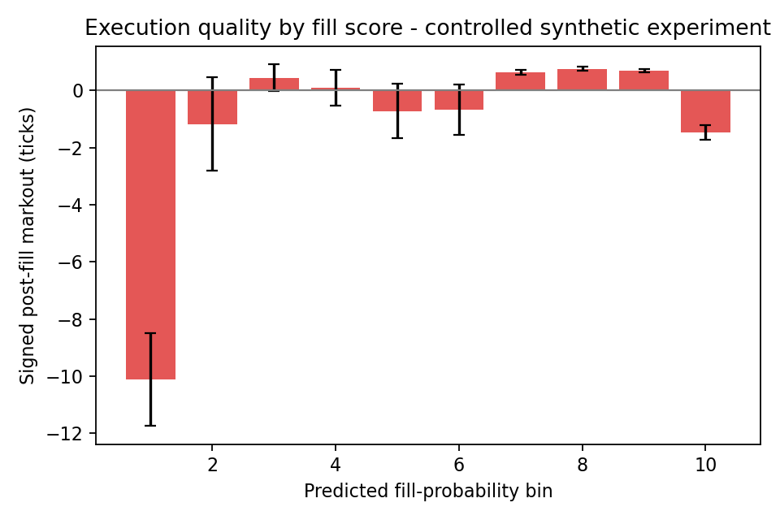

# When Is a Fill Bad?

**Can passive-order states with higher fill likelihood produce worse post-fill execution quality?**

## Core Idea

Execution likelihood is not execution quality. A passive order may become easier to fill because the queue ahead is being depleted, but the resulting fill can still be economically poor if the post-fill mid-price moves against the passive trader. This project studies that distinction with a controlled event-driven limit-order-book experiment.



## What I Built

- Event-driven synthetic LOB experiment.
- Hypothetical passive-order replay at the best bid and best ask.
- Fill, censoring, and signed post-fill markout labels.
- Queue- and flow-conditioned features at submission time.
- Chronological train/validation/test evaluation.
- Nested baseline/mechanism model comparison.
- Leakage checks and local shuffled-null diagnostic.
- Reproducible figures and tables.

## Data And Evidence Boundary

| Item | Current project state |
|---|---|
| Data | Controlled synthetic event stream |
| Exchange | None |
| Instrument | Simulated |
| Empirical BTC claim | None |
| Live profitability claim | None |

The synthetic data are used to validate the research pipeline: replay, labels, side conventions, chronological evaluation, and mechanism testing. The current repository does **not** contain empirical Bitcoin results.

## Main Finding

The current run supports the core distinction between fill likelihood and execution quality. Predicted fill-score bins have different realized fill rates and different conditional post-fill markouts. The relationship is not monotonic: some easier-fill states have negative markout, while some lower-score states have better markout.

| Quantity | Current evidence |
|---|---|
| Hypothetical passive orders | 6428 |
| Overall fill rate | 0.5708 |
| Fill-score bin 10 fill rate | 0.8140 |
| Fill-score bin 10 signed markout | -1.4665 ticks |
| Fill-score bin 8 fill rate | 0.5039 |
| Fill-score bin 8 signed markout | +0.7524 ticks |

This is the useful tension: an order can be easier to fill without being a better fill.

## Mechanism Test

The project tests whether local signed-flow persistence and passive-side queue depletion explain fast but adverse fills. The nested comparison is:

- M0: controls only;
- M1: controls + flow persistence;
- M2: controls + flow persistence + depletion;
- M3: controls + flow persistence + depletion + interaction.

The interaction result is weak in the current synthetic run. At the best M3 fill-AUC window, W=50, the M3 fill ROC AUC is 0.5261 and M3-M2 AUC is -0.00087. This does not justify a strong mechanism claim. The mechanism remains a disciplined hypothesis test rather than a discovered law.

## Reproduce

```bash
make reproduce
make test
```

Equivalent commands:

```bash
python3 scripts/run_main_analysis.py
PYTHONPATH=src python3 -m unittest discover tests
```

Outputs:

- `outputs/figures/main/`
- `outputs/figures/appendix/`
- `outputs/tables/main/`
- `outputs/tables/appendix/`
- `data/processed/`

## Limitations

- Synthetic-data dependence.
- Queue position is proxied from displayed depth.
- Event generation is simplified.
- Hidden liquidity is not modeled.
- Latency and partial fills are simplified.
- No exchange-specific microstructure.
- No real transaction-cost model.
- No live execution or profitability claim.

## Next Empirical Step

Run the unchanged labeling and evaluation pipeline on a single-venue BTC-USD L2 or L3 event stream.

