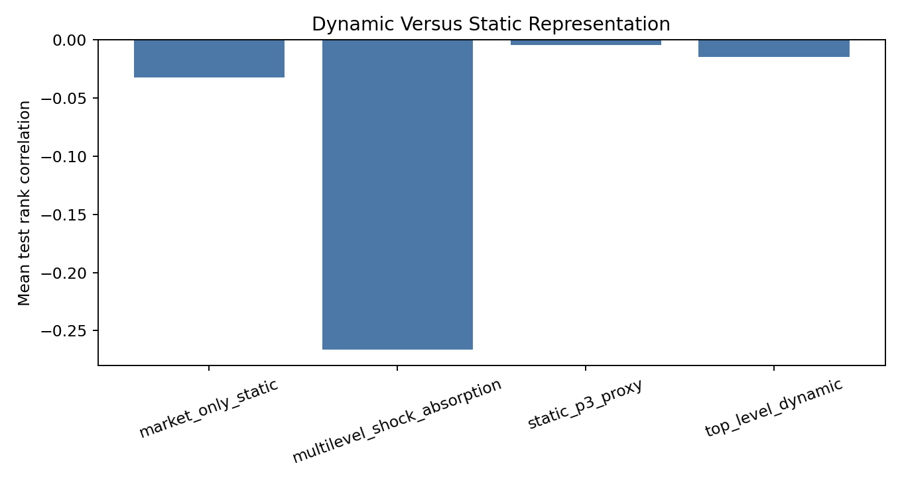

# When Is a Fill Bad?
## Fill Likelihood, Quote Pressure, and Post-Quote Markout

**Can passive-side states associated with easier execution also produce worse post-fill or post-quote price outcomes?**

This repository studies the distinction between execution likelihood and execution quality. The synthetic layer provides exact hypothetical passive fills and signed post-fill markouts. The real Coinbase BTC layer cannot observe FIFO fills, so it validates the same mechanism through quote-pressure episodes, visible-depth penetration, post-shock absorption, best-quote survival, and future side-adjusted markout.

The central empirical lesson is restrained: a static composite execution-pressure proxy is not enough. In the real BTC sample, separating the process into **shock -> penetration -> absorption -> quote survival -> markout response** produces a clearer state ranking than market-only or static P3 proxies, but the result remains a proxy study rather than a claim about exact live fills.



## Evidence Design

```text
Synthetic controlled experiment
-> exact hypothetical passive fills
-> fill likelihood
-> post-fill signed markout

Real Coinbase BTC validation
-> one-second quote-pressure episodes
-> potential visible-depth penetration
-> absorption and quote-survival response
-> future side-adjusted post-quote markout
```

## Data Boundary

| Item | Value |
|---|---:|
| Real dataset | Coinbase BTC |
| Rows | 1,030,728 |
| Frequency | ~1 second |
| Visible depth | 15 levels |
| Date range | 2021-04-07 to 2021-04-19 UTC |
| Available activity | market / limit / cancel notional |
| Exact FIFO fills | unavailable |
| Live trading claim | none |

The real-data layer uses one-second snapshots and interval aggregates. It supports empirical quote-pressure validation, not order-level queue reconstruction.

## Research System

- Synthetic exact-fill experiment for controlled passive-order replay.
- Million-row Coinbase BTC data pipeline with schema audit and Parquet conversion.
- Side-adjusted passive-buy and passive-sell markout conventions.
- Static execution-pressure baselines: market-only, market + cancellation, and market + cancellation - replenishment.
- Dynamic shock analysis using 15-level visible depth, potential penetration, absorption, quote survival, and recovery paths.
- Chronological train/validation/test evaluation, local null tests, and reproducible output tables and figures.

## Main Result

The first real-data proxy test found that richer static pressure signals did not reliably outperform market-order pressure alone. That negative result motivated a narrower dynamic audit: condition on large quote-pressure shocks, then measure whether the visible book absorbs or fails to absorb the shock.

On the untouched test period, the dynamic multi-level shock-absorption representation produces substantially more adverse high-minus-low markout ordering than the static baselines:

| Side | Representation | High-minus-low 60s markout | Rank correlation |
|---|---|---:|---:|
| buy | market-only static | -2.4431 bps | -0.0244 |
| buy | static P3 proxy | -1.7760 bps | -0.0148 |
| buy | multi-level shock absorption | -10.3845 bps | -0.2416 |
| sell | market-only static | -1.7864 bps | -0.0406 |
| sell | static P3 proxy | -1.5306 bps | +0.0056 |
| sell | multi-level shock absorption | -11.2888 bps | -0.2915 |

Absorption states are economically interpretable. Weak absorption has negative 60s markout and low quote survival; strong absorption has positive 60s markout and materially higher quote survival.

## Null Result And Boundary

A stratified local null preserves date, side, and potential penetration class while shuffling markout alignment. The dynamic representation remains more adverse than the null average in both directions, but linear projection R2 remains small. The result is best read as **state ordering and mechanism diagnostics**, not as a high-accuracy return prediction model.

## Reproduction

```bash
make dynamic-lob
python -m pytest tests
```

Earlier validation layers remain available:

```bash
make real-btc-validation
make reproduce
```

## Limitations

- Exact real passive fills and FIFO queue position are unavailable.
- One-second aggregation removes intrasecond event order.
- Potential penetration is measured against visible depth, not actual hidden liquidity or order IDs.
- The sample covers one venue and a short date range.
- Linear predictive R2 is small even when dynamic state ordering is clear.
- No live trading, market-making, or profitability claim is made.

## Review Path

30 seconds: README figure and result table.

3 minutes: [PORTFOLIO_BRIEF.md](PORTFOLIO_BRIEF.md).

15 minutes: [RESEARCH_NOTE.md](RESEARCH_NOTE.md).

Code: `src/fillbad/`, `scripts/run_dynamic_lob_analysis.py`, and `tests/test_dynamic_lob.py`.
